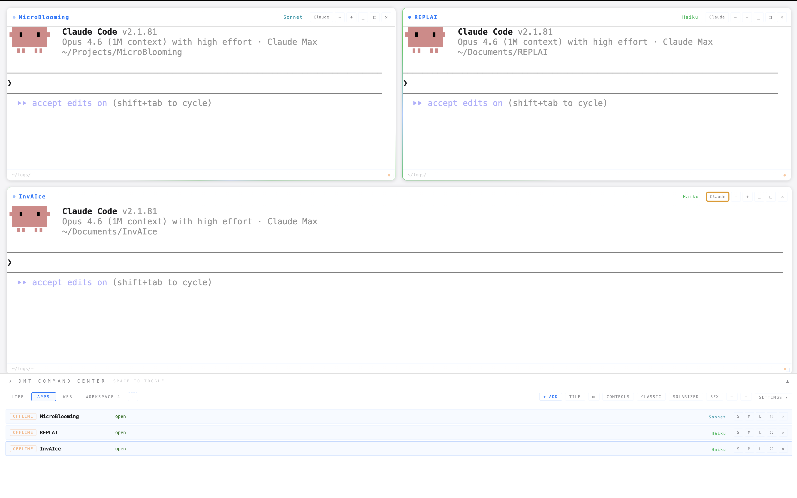

# Doors Mega Terminal

A command center for running parallel AI coding agents. Built for the era where one developer runs five Claude Code sessions at once and needs to know which one just broke something.


---

## The Problem

You are running Claude Code on four projects. One is waiting for `[y/n]`. Another just hit a fatal error. A third finished five minutes ago and you did not notice. The fourth is writing code that conflicts with the second because they share a repo.

DMT solves all of this.

---

## What It Does

**One window to rule them all.** DMT gives you a floating, tiled terminal manager where every pane is a real terminal session (node-pty, not a web fake). Each terminal can run Claude Code, Codex, or anything else. The app watches the output and tells you what is happening.

### Agent Intelligence

DMT parses terminal output in real time and classifies each agent's state:

| State | Visual | Trigger |
|---|---|---|
| **THINKING** | Blue pulse | Claude is processing |
| **WRITING** | Purple pulse | Code output detected |
| **WAITING** | Yellow pulse + sound | `[y/n]`, `Continue?`, `Press Enter` detected |
| **DONE** | Green glow + snake animation | Claude stop signal received |

You see all of this in the **Command Center Ledger**: a sidebar showing every window across every workspace, with its state, git branch, model, and token cost.

### Git Worktree Isolation

The killer feature. When you open a terminal on a project, DMT can create an **isolated git worktree** for that window. This means:

- 4 agents working on the same repo at the same time
- Each in its own directory, its own branch state, its own working tree
- No merge conflicts between agents
- Worktrees auto-cleanup when you close the window
- `.scc-worktrees` is auto-added to `.gitignore`

This is what makes parallel agent development actually work. Without it, two agents editing the same file will destroy each other's work.

### Git Diff Panel

Press `G` to open a color-coded diff panel showing exactly what changed in the focused window's directory. Additions in green, deletions in red, file headers highlighted. Auto-refreshes when you switch windows. See what your agent did without opening another terminal.

### Token and Cost Tracking

DMT parses Claude Code's token output (`Tokens: N input, N output`) and calculates API-equivalent cost using current rates:

- **Haiku**: $0.25/1M input, $1.25/1M output
- **Sonnet**: $3/1M input, $15/1M output
- **Opus**: $15/1M input, $75/1M output

Per-window cost in the ledger. Monthly budget bar in the toolbar with warning (80%) and over-budget states.

### Workspace System

- Named workspaces with color-coded tabs
- 8 preset accent colors per workspace (injected as CSS variables)
- Session restore: saves all window positions, projects, and accents. RESTORE button in toolbar brings everything back.
- Workspace add/rename/delete with confirmation

### Keyword Alerts

Configurable regex rules that scan terminal output. Defaults: `error`, `failed`, `fatal`, `ENOENT`. When triggered: red flash border + alert sound. Full settings panel to add, toggle, delete, and test patterns.

### Ask Claude

One-click button grabs the last 50 clean terminal lines from any window and sends them to a Claude Code panel running in the same project directory. Context handoff without copy-pasting.

---

## Three Themes

| Cyan Cockpit | Classic | Hyperspace |
|---|---|---|
|  |  |  |

- **Cyan Cockpit**: Dark mission control. Cockpit background, animated starfield, cyan accents.
- **Classic**: Clean terminal aesthetic. Auto day/night mode (light 06:00-20:00, dark otherwise), or manual override.
- **Hyperspace**: Psychedelic fractal background, animated side panels. For when you want to feel like you are inside the machine.

Each theme changes backgrounds, panel animations, starfield behavior, and color variables.

---

## Keyboard Shortcuts

| Key | Action |
|---|---|
| `` ` `` | Open/close Shortcut Center |
| `G` | Toggle git diff panel |
| `Cmd+N` | New window in current workspace |
| `Cmd+W` | Close focused window |
| `Cmd+T` | Tile windows (grid) |
| `Cmd+[` / `Cmd+]` | Previous / next window |
| `Cmd+L` | Toggle command center ledger |
| `Cmd+M` | Toggle task monitor |

Full list in the Shortcut Center (`` ` ``).

---

## Install

Download the latest DMG from [Releases](https://github.com/DoorsOfJanua/doors-mega-terminal/releases).

macOS arm64 only (Apple Silicon). Open DMG, drag to Applications.

> The app is unsigned. On first launch: right-click, Open, Open anyway.

---

## Build from Source

```bash
git clone https://github.com/DoorsOfJanua/doors-mega-terminal
cd doors-mega-terminal
npm install
npm start          # dev mode
npm run dist       # build DMG
```

Node 18+ required.

---

## Architecture

```
main.js            Electron main process. Window management, IPC handlers,
                   pty spawning, git operations, config, claude-done watcher.

preload.js         contextBridge (window.scc.*). All renderer-to-main
                   communication goes through here. No nodeIntegration.

renderer/
  main.js          All UI logic. Workspaces, windows, ledger, task monitor,
                   settings panels, theme system, starfield, drag/resize.
  terminal.js      xterm.js wrapper. Terminal init, token parsing, keyword
                   scanning, approval detection, getLastLines.
  index.html       CSS + HTML shell.

config.js          JSON config read/write with defaults. ~/.spaceship/config.json
pty-manager.js     node-pty process management. Spawn, write, resize, kill.
```

No React. No framework. Vanilla JS. The renderer is built with Vite for production.

---

## Claude Code Integration

Add to `~/.claude/settings.json` to get the stop signal (snake animation + sound when Claude finishes):

```json
{
  "hooks": {
    "Stop": [{ "hooks": [{ "type": "command", "command": "afplay /System/Library/Sounds/Glass.aiff 2>/dev/null; touch ~/.spaceship/.claude-done" }] }]
  }
}
```

DMT watches `~/.spaceship/.claude-done` for mtime changes. When it detects a new write, it triggers the completion animation in the active window.

---

## Version History

**v0.3.0** (March 23, 2026)
Git worktree isolation per window, agent status detection (THINKING/WRITING/WAITING/DONE), git diff panel with syntax coloring, workspace delete with confirmation modal, public release with DMG.

**v0.2.1** (March 22, 2026)
Bug fix patch from Codex audit. Ask Claude targeting hardened (checks window title), config write race eliminated (centralized patchConfig queue), session restore resilient (path as primary key, title as fallback). 39/39 tests passing.

**v0.2.0** (March 22, 2026)
Token/cost tracker, keyword alerts with regex, git branch in ledger, session restore, per-workspace accent colors (8 presets), auto-detect needs-input, Ask Claude button.

**v0.1.0** (March 21, 2026)
Initial release. 3 themes (Cyan Cockpit, Classic with auto day/night, Hyperspace), workspace management, font size control (8-32px), tiling modes (grid/horizontal/vertical), cross-workspace tab glow, task monitor panel, command center ledger, Claude stop signal detection with snake animation.

---

## What It Does Not Do (Yet)

- Split pane within a single window
- Command history search across windows
- Terminal tabs inside a panel
- Broadcast mode (type once, send to all)
- Apple notarization (works fine unsigned)

---

## License

MIT

---

Built by [Janua](https://doorsofjanua.com). From v0.1.0 to v0.3.0 in 48 hours. Three themes, agent state detection, git worktree isolation, 39 passing tests, and a DMG. This is what happens when you build the tool you need.
